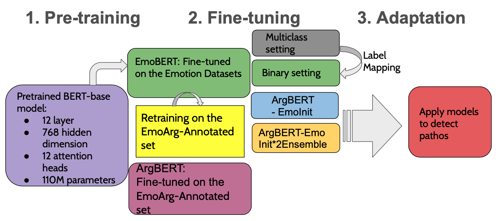
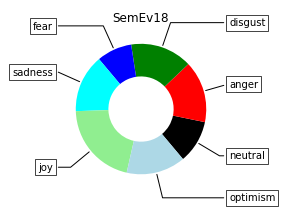
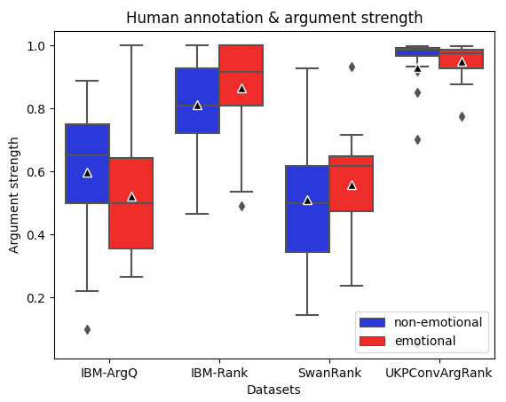

## Project description and aim 
This project gives insights into the code of my master's thesis. 

## Detecting arguments with pathos (emotional appeal)
Aim of the thesis was to build machine learning models able to detect arguments with pathos, i.e. emotional appeal. Such arguments can for example be useful in risk management, as
in communicating health implications that can come with smoking. While some people might be convinced by arguments based on facts and figures, others are persuaded when arguments also trigger 
emotions like fear. The latter type of arguments are referred to as arguments with pathos or emotional appeal. 

A pre-trained BERT model (https://arxiv.org/pdf/1810.04805.pdf) was fine-tuned for emotion detection, and retrained resulting in model variants as given in the following image. 

## Code overview
### Data preprocessing
Shows some sample files of my data preprocessing work.

### Machine learning models
Two variants of implementing the machine learning cycle of training, validating and inference are given:

1) The PyTorch Native implementation, where the BERT model's architecture is adapted
to enable ensemble learning through a shared linear layer

2) The Huggingface implementation (slightly adapted from Team Orange (MIT Licence))

### Data Visualization 
1. #### Example pie plot (jupyter notebook) 
   

2. #### Example bar plot 

3. #### Example box plot 

