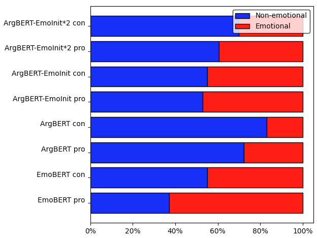

# Detecting arguments with emotional appeal
## Project description and aim 

This code base gives insights into the work of my master's thesis. 

Studies have shown that people are sometimes more easily convinced by an argument if it triggers emotions than if it is merely based on facts.

Being able to automatically mine corpora for such arguments (simply addressed as 'emotional arguments') can find application in risk management, as in communicating health implications that can come with smoking or explaining possible consequences of climate change. 
Further, according to research, people who are easily convinced by emotional arguments, are also oftentimes prone to believe in propaganda and fake news. 
Providing a tool detecting emotional arguments can hence help e.g. the social sciences to develop a better understanding of this matter. 

An excerpt of the arguments classified as '(non-)emotional' in this project can be found here: <a href="https://github.com/Isa-May/EmoArgumentPool"> EmoArgumentPool</a>.

In the original project, the models were trained on an NVIDIA Tesla V100 from an Ubuntu 20.02 machine with an AMD Ryzen Processor, 32 CPU Cores, and 126 GB memory. Python 3.8.10, Pytorch 1.8.0 + cu111, the Huggingface Transformer library 4.5.1, and the Huggingface Dataset library 1.6.2 were used.

**However, the project as displayed here only shows excerpts of the code for demonstration purposes and is not set up to be runnable as is.**

## Code overview
### Data preprocessing
Shows some sample files of my data preprocessing work.

### Machine learning models
A pre-trained BERT model (https://arxiv.org/pdf/1810.04805.pdf) was fine-tuned for emotion detection, and retrained resulting in model variants as given in the following image. 

Two variants of implementing the machine learning cycle of training, validating and inference are given in the code:

1) The PyTorch Native implementation, where the BERT model's architecture is adapted
to enable ensemble learning through a shared linear layer

2) The Huggingface implementation (slightly adapted from Team Orange (MIT Licence))

### Data Visualisation 
1. #### Example pie plot (jupyter notebook) 
   

2. #### Example bar plot 

3. #### Example box plot 

